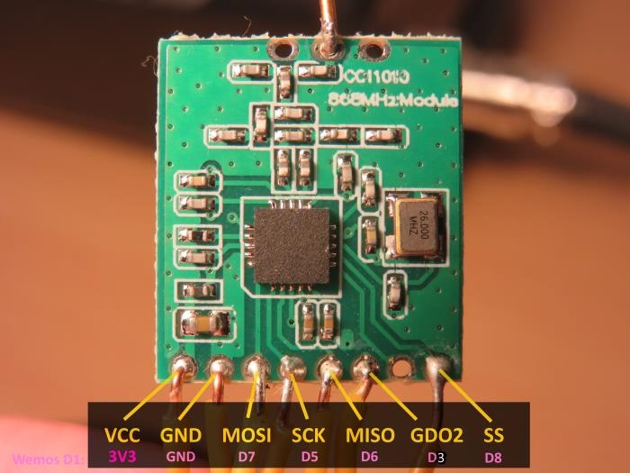

# Easy-ESP-IoT-Arduino-CC1101-LORA

This is an easy to use Arduino CC1101 library (working example) to be able to connect a [Texas Instruments CC1101](http://www.ti.com/product/CC1101) to a ESP32 or ESP8266.

# Buying a CC1101

CC1101 modules can be bought [for a few bucks](https://www.aliexpress.com/item/CC1101-Wireless-Module-Long-Distance-Transmission-Antenna-868MHZ-M115/32635393463.html). These modules are tolerant of voltages ranging from 1.8 to 3.3 volts.

# Using a CC1101

Whilst the CC1101 is almost a 10 year old device, it is used is MANY low power or long life battery operated devices to transmit data. Given these transceivers work on the low frequency ISM bands (433, 868, 915 etc.), signals can travel a fair distance. The CC1101 is technically [better](https://www.youtube.com/watch?v=7zLUYswu3Ek) to the often mentioned LoRA / Semtech chip technology [apparently](https://e2e.ti.com/support/wireless-connectivity/sub-1-ghz/f/156/t/343273?Semtech-LoRa-vs-Performance-line-TI#).

Whilst the CC1101 has some [show stopper bugs](http://www.ti.com/lit/er/swrz020e/swrz020e.pdf) this Arduino library aggressively works around these issues and as a result is reliable with continuous send and receive operation. 

This library supports sending large strings/streams of data, using multiple 61 byte radio packets (that's the CC1101's underlying fixed radio packet size). However, using this functionality increases the risk of lost data - so your own packet/message acknowledgement code would be required. 

# Installation

Pull this repository, and load the .ino file onto two ESP8266 devices with the opposite sending/receiving addresses configured (refer to the sketch code).

# Connecting your ESP 8266 / ESP 32

Use the standard SPI ports to connect to the 8 pins on the CC1101 module. For example, with the Wemos D1 Mini (ESP8266 Chip), it's easy as:




Example serial output with debugging:
```
---------- END: RX Interrupt Request  -------------
Recieved Message: Message #252 from device 64. Hello 32, I hope this messagge gets to you well and good. This message is approx 130 characters in length.
Sending message: Message #12 from device 32. Hello 64, I hope this message gets to you well and good. This message is approx 130 characters in length.
Took 201 milliseconds to complete sendChars()
---------- START: RX Interrupt Request  -------------
* Packet Received
* RX FIFO bytes pending read: 63
Error: Bytes left over in RX FIFO: 0
Took 2 milliseconds to complete recievePacket()
Received packet...
lqi: 13
rssi: -47dBm
stream_num_of_pkts: 3
stream_pkt_seq_num: 1
payload_size: 57
data: Message #253 from device 64. Hello 32, I hope this messag>2x⸮⸮?⸮T@
Recieved stream packet 1 of 3. Buffer start position: 0, end position 57, payload size: 57
---------- END: RX Interrupt Request  -------------
---------- START: RX Interrupt Request  -------------
* Packet Received
* RX FIFO bytes pending read: 63
Error: Bytes left over in RX FIFO: 0
Took 2 milliseconds to complete recievePacket()
Received packet...
lqi: 17
rssi: -47dBm
stream_num_of_pkts: 3
stream_pkt_seq_num: 2
payload_size: 57
data: ge gets to you well and good. This message is approx 130 ?.9
Recieved stream packet 2 of 3. Buffer start position: 57, end position 114, payload size: 57
---------- END: RX Interrupt Request  -------------
---------- START: RX Interrupt Request  -------------
* Packet Received
* RX FIFO bytes pending read: 63
Error: Bytes left over in RX FIFO: 0
Took 2 milliseconds to complete recievePacket()
Received packet...
lqi: 13
rssi: -47dBm
stream_num_of_pkts: 3
stream_pkt_seq_num: 3
payload_size: 21
data: characters in length.nd good. This messa"
Recieved stream packet 3 of 3. Buffer start position: 114, end position 135, payload size: 21
STREAM HAS BEEN RECIEVED IN FULL
---------- END: RX Interrupt Request  -------------
Recieved Message: Message #253 from device 64. Hello 32, I hope this messagge gets to you well and good. This message is approx 130 characters in length.
Sending message: Message #13 from device 32. Hello 64, I hope this message gets to you well and good. This message is approx 130 characters in length.
Took 203 milliseconds to complete sendChars()
```
