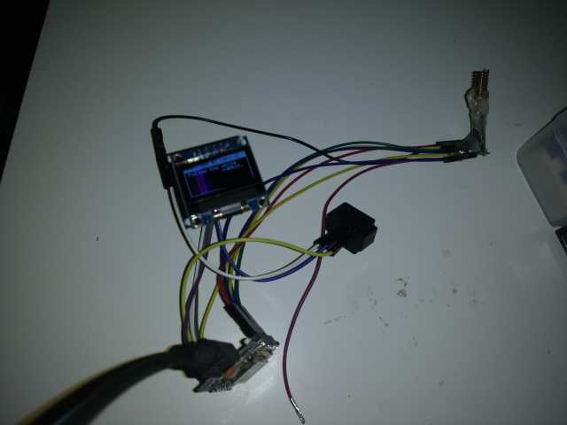

# AES 128 Transmit and Recieve

This is an example of using the Easy-IoT-Arduino-CC1101-LORA library to send cipher-text messages over the air. Don't want to use a mobile network and the government to hear your conversations? Well, I'm not sure this is the solution! 


## Wiring

Wire up the CC1101 to the ESP as mentioned in the main README. This example also makes use of a generic [OLED Display](https://www.aliexpress.com/item/32767499263.html?spm=a2g0s.9042311.0.0.27424c4dBKzhaz) from Aliexpress to receive a message.



## Use

In the code you'll need to set the shared key to something different.


```
byte *key = (unsigned char*)"0123456789010123";
```

The use the serial monitor to send a message to another device with the OLED attached.


## Credits

This library builds upon [spaniakos's](https://github.com/spaniakos/AES) AESLib library, which is a derivation of Brian Gladman's AES implementation for byte-oriented processors.